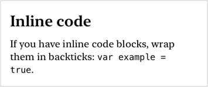
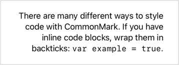
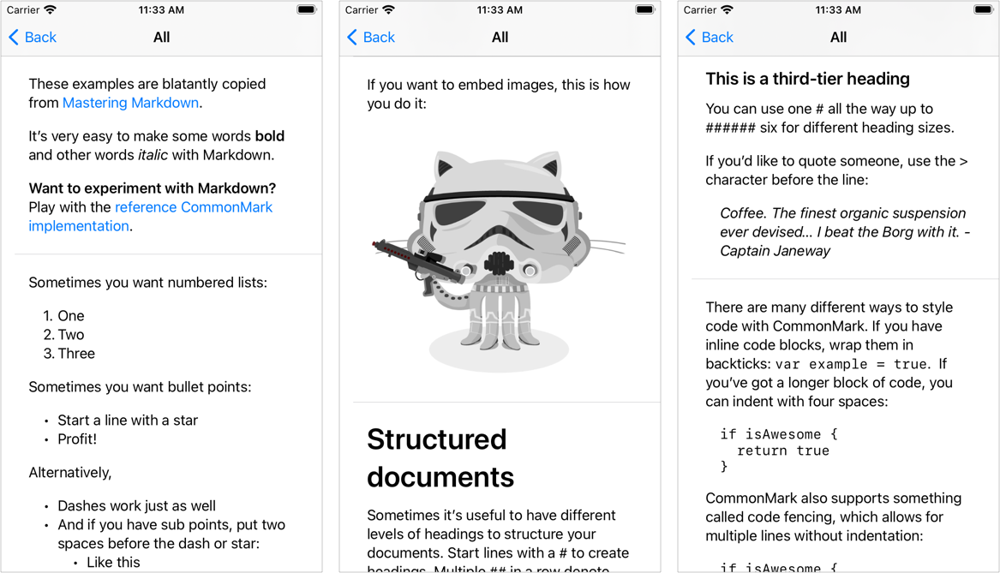

# MarkdownUI
[](https://github.com/gonzalezreal/MarkdownUI/actions?query=workflow%3ACI)
[](https://swiftpackageindex.com/gonzalezreal/MarkdownUI)
[](https://swiftpackageindex.com/gonzalezreal/MarkdownUI)
[](https://twitter.com/gonzalezreal)

MarkdownUI is a library for rendering Markdown in SwiftUI, fully compliant with the [CommonMark Spec](https://spec.commonmark.org/current/).

## Supported Platforms

You can use the `Markdown` SwiftUI view in the following platforms:

* macOS 11.0+
* iOS 14.0+
* tvOS 14.0+

The `NSAttributedString` extension is available in: 

* macOS 10.12+
* iOS 11.0+
* tvOS 11.0+
* watchOS 3.0+

## Usage

You can create a `Markdown` view in SwiftUI by providing a CommonMark document.

```swift
Markdown(
    #"""
    It's very easy to make some words **bold** and other words *italic* with Markdown.

    **Want to experiment with Markdown?** Play with the [reference CommonMark
    implementation](https://spec.commonmark.org/dingus/).
    """#
)
```


From Swift 5.4 onwards, you can create a `Markdown` view using an embedded DSL for the contents.

```swift
Markdown {
    Heading(level: 2) {
        "Markdown lists"
    }
    "Sometimes you want numbered lists:"
    List(start: 1) {
        "One"
        "Two"
        "Three"
    }
    "Sometimes you want bullet points:"
    List {
        "Start a line with a star"
        "Profit!"
        Item {
            "And you can have sub points:"
            List {
                "Like this"
                "And this"
            }
        }
    }
}
```

A Markdown view renders text using a `body` font appropriate for the current platform.
You can choose a different font or customize other properties like the foreground color,
code font, or heading font sizes using the `markdownStyle(_:)` view modifier.

```swift
Markdown(
    #"""
    ## Inline code
    If you have inline code blocks, wrap them in backticks: `var example = true`.
    """#
)
.markdownStyle(
    DefaultMarkdownStyle(
        font: .system(.body, design: .serif),
        codeFontName: "Menlo",
        codeFontSizeMultiple: 0.88
    )
)
```



A Markdown view always uses all the available width and adjusts its height to fit its
rendered text.

Use the `accentColor(_:)` view modifier to configure the link color.

```swift
Markdown("Play with the [reference CommonMark implementation](https://spec.commonmark.org/dingus/).")
    .accentColor(.purple)
```

Use modifiers like `lineLimit(_:)`  and `truncationMode(_:)` to configure
how the view handles space constraints.

```swift
Markdown("> Knowledge is power, Francis Bacon.")
    .lineLimit(1)
```

You can set the alignment of the text by using the `multilineTextAlignment(_:)` view modifier.

```swift
Markdown(
    #"""
    There are many different ways to style code with CommonMark. If you
    have inline code blocks, wrap them in backticks: `var example = true`.
    """#
)
.multilineTextAlignment(.trailing)
```



### Using the NSAttributedString Extension
If you are not yet using SwiftUI, you can use the `NSAttributedString` extension to render Markdown in your app.

```swift
let attributedString = NSAttributedString(
    document: #"""
    It's very easy to make some words **bold** and other words *italic* with Markdown.
    """#,
    style: DefaultMarkdownStyle(font: .system(.body))
)
```

## Supported Markdown Elements
MarkdownUI uses the [CommonMark](https://github.com/commonmark/cmark) reference parser and it is fully compliant with the [CommonMark Spec](https://spec.commonmark.org/current/).

You can explore all the capabilities of this package in the [companion demo project](Examples/MarkdownUIDemo).



## Installation
You can add MarkdownUI to an Xcode project by adding it as a package dependency.
1. From the **File** menu, select **Swift Packages › Add Package Dependency…**
1. Enter `https://github.com/gonzalezreal/MarkdownUI` into the package repository URL text field
1. Link **MarkdownUI** to your application target

### Bundled Image Assets
Using the `resource` scheme, you can now load images from your bundled images or asset catalogs. This lets you use vector formats (PDF and SVG), specify appearance, scale and device variants, etc.  

```swift
Markdown(
    #"""
    This is a local asset image:
    
    """#
)
```

To load the image asset from a specific bundle, insert its identifier in the URL's host name,
for example `resource://bundleid/imagename`.

To load all images from the main bundle by default, set the base URL like this:

```swift
Markdown(
    #"""
    This is a local resource image:
        
    """#
)
.markdownBaseURL(.mainBundleResources)
```

## Other Libraries
* [CommonMarkAttributedString](https://github.com/mattt/CommonMarkAttributedString)
* [Down](https://github.com/johnxnguyen/Down)
* [AttributedText](https://github.com/gonzalezreal/AttributedText)
