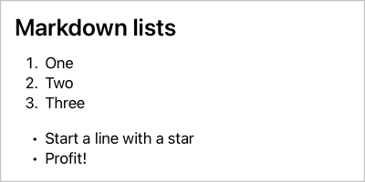
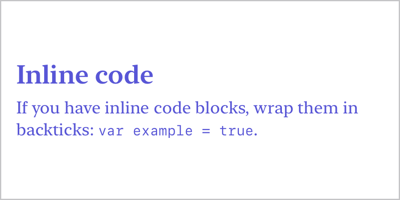
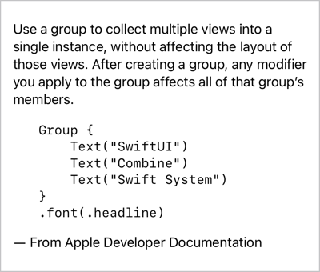
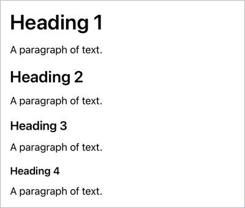
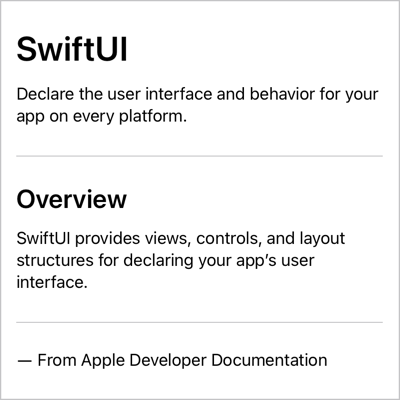
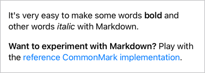

# MarkdownUI
[](https://github.com/gonzalezreal/MarkdownUI/actions?query=workflow%3ACI)
[](https://swiftpackageindex.com/gonzalezreal/MarkdownUI)
[](https://swiftpackageindex.com/gonzalezreal/MarkdownUI)
[](https://twitter.com/gonzalezreal)

MarkdownUI is a Swift package for rendering Markdown in SwiftUI, fully compliant with the
[CommonMark Spec](https://spec.commonmark.org/current/).

## Supported Platforms

You can use MarkdownUI in the following platforms:

* macOS 11.0+
* iOS 14.0+
* tvOS 14.0+

## Usage

You can create a `Markdown` view by providing a Markdown-formatted string.

```swift
Markdown("You can try **CommonMark** [here](https://spec.commonmark.org/dingus/).")
```


If you have already parsed a Markdown-formatted string into a CommonMark document, you can
initialize a `Markdown` view with it.

```swift
let document = try! Document(
  markdown: "You can try **CommonMark** [here](https://spec.commonmark.org/dingus/)."
)

var body: some View {
  Markdown(document)
}
```

Alternatively, you can use an embedded DSL to describe the content of a Markdown view.

```swift
Markdown {
  Heading(level: 2) {
    "Markdown lists"
  }
  OrderedList {
    "One"
    "Two"
    "Three"
  }
  BulletList {
    "Start a line with a star"
    "Profit!"
  }
}
```



### Relative URLs

When creating a `Markdown` view, specify a base URL if you want to use relative URLs in your
Markdown content.

```swift
Markdown(
  #"""
  You can explore all the capabilities of this package in the
  [companion demo project](Examples/MarkdownUIDemo).
  """#,
  baseURL: URL(string: "https://github.com/gonzalezreal/MarkdownUI/raw/main/")
)
```

### Loading asset images

A `Markdown` view downloads and presents the images it finds in the Markdown-formatted content. You
may want to store some of your content's images locally. In that case, you can configure a
`Markdown` view to load images with a given URL scheme from the asset catalog.

```swift
Markdown(
  #"""
  The Markdown view loads this image from the network:
  

  And looks for this other image in the app's bundle:
  
  """#
)
.setImageHandler(.assetImage(), forURLScheme: "asset")
```

### Customizing appearance

A `Markdown` view renders its content with a default base font, color, and measurements appropriate
for the current environment. You can customize some or all of these values by passing a new
`MarkdownStyle` to the `markdownStyle(_:)` view modifier.

```swift
Markdown(
  #"""
  ## Inline code
  If you have inline code blocks, wrap them in backticks: `var example = true`.
  """#
)
.markdownStyle(
  MarkdownStyle(
    font: .system(.body, design: .serif),
    foregroundColor: .indigo,
    measurements: .init(
      codeFontScale: 0.8,
      headingSpacing: 0.3
    )
  )
)
```



### Customizing link handling

By default, a `Markdown` view opens the links in its content using the appropriate system service.
However, you can provide a custom Markdown link handler using the `onOpenMarkdownLink` modifier.

```swift
struct ContentView: View {
  @State private var url: URL? = nil
  @State private var showingAlert = false

  var body: some View {
    Markdown(
      #"""
      **MarkdownUI** is a library for rendering Markdown in *SwiftUI*, fully compliant with the
      [CommonMark Spec](https://spec.commonmark.org/current/).
      """#
    )
    .onOpenMarkdownLink { url in
      self.url = url
      self.showingAlert = true
    }
    .alert(isPresented: $showingAlert) {
      Alert(
        title: Text("Open Link"),
        message: Text(self.url?.absoluteString ?? "nil")
      )
    }
  }
}
```

Alternatively, if your deployment target is macOS 12.0+ or iOS 15.0+, you can customize Markdown
link handling by setting the `openURL` environment value.

```swift
Markdown(
  #"""
  **MarkdownUI** is a library for rendering Markdown in *SwiftUI*, fully compliant with the
  [CommonMark Spec](https://spec.commonmark.org/current/).
  """#
)
.environment(
  \.openURL,
  OpenURLAction { url in
    self.url = url
    self.showingAlert = true
    return .handled
  }
)
```

## Supported Markdown Elements
MarkdownUI uses the [CommonMark](https://github.com/commonmark/cmark) reference parser and
fully complies with the [CommonMark Spec](https://spec.commonmark.org/current/).

Below you can see a few examples of how MarkdownUI renders Markdown elements. Additionally, you can
explore the full MarkdownUI capabilities in the [companion demo project](Demo/).


### Block Quotes

```swift
Markdown(
  #"""
  > “I sent the club a wire stating,
  > **PLEASE ACCEPT MY RESIGNATION. I DON'T
  > WANT TO BELONG TO ANY CLUB THAT WILL ACCEPT ME AS A MEMBER**.”

  ― Groucho Marx
  """#
)
```


### Lists

```swift
Markdown(
  #"""
  List of humorous units of measurement:

  1. Systems
     - FFF units
     - Great Underground Empire (Zork)
     - Potrzebie
  1. Quantity
     - Sagan
  1. Length
     - Altuve
     - Attoparsec
     - Beard-second

  ― From Wikipedia, the free encyclopedia
  """#
)
```


### Code Blocks

```swift
Markdown(
  #"""
  Use a group to collect multiple views into a single instance,
  without affecting the layout of those views. After creating a
  group, any modifier you apply to the group affects all of that
  group’s members.

      Group {
          Text("SwiftUI")
          Text("Combine")
          Text("Swift System")
      }
      .font(.headline)

  ― From Apple Developer Documentation
  """#
)
```



### Headings

```swift
Markdown(
  #"""
  # Heading 1
  A paragraph of text.
  ## Heading 2
  A paragraph of text.
  ### Heading 3
  A paragraph of text.
  #### Heading 4
  A paragraph of text.
  """#
)
```



### Thematic Breaks

```swift
Markdown(
  #"""
  # SwiftUI

  Declare the user interface and behavior for your app
  on every platform.

  ---

  ## Overview

  SwiftUI provides views, controls, and layout structures
  for declaring your app’s user interface.

  ---

  ― From Apple Developer Documentation
  """#
)
```



### Images

```swift
Markdown(
  #"""
  

  ― Photo by André Spieker
  """#
)
```


### Emphasized Text

```swift
Markdown(
  #"""
  It's very easy to make some words **bold** and other words *italic* with Markdown.

  **Want to experiment with Markdown?** Play with the [reference CommonMark
  implementation](https://spec.commonmark.org/dingus/).
  """#
)
```



## Installation
You can add MarkdownUI to an Xcode project by adding it as a package dependency.

1. From the **File** menu, select **Add Packages…**
1. Enter `https://github.com/gonzalezreal/MarkdownUI` into the *Search or Enter Package URL* search
   field
1. Link **MarkdownUI** to your application target

## Other Libraries
* [CommonMarkAttributedString](https://github.com/mattt/CommonMarkAttributedString)
* [Down](https://github.com/johnxnguyen/Down)
* [AttributedText](https://github.com/gonzalezreal/AttributedText)
