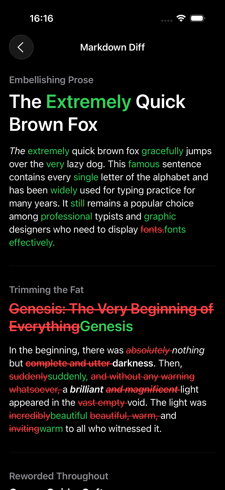

# MarkdownDiff

A fork of [gonzalezreal/swift-markdown-ui](https://github.com/gonzalezreal/swift-markdown-ui) that adds `MarkdownDiff` - a simple way to display diffs between two Markdown strings in SwiftUI.

For full documentation on the base MarkdownUI library, please see the [original repository](https://github.com/gonzalezreal/swift-markdown-ui).

